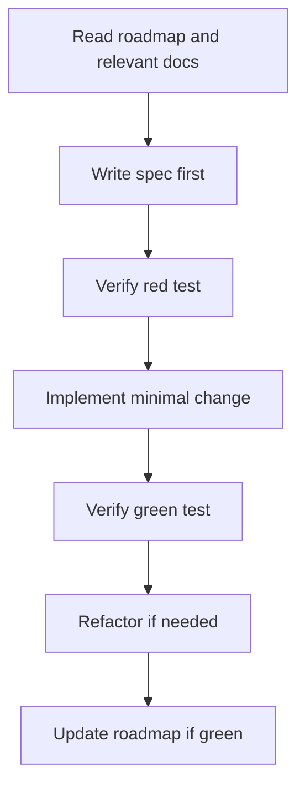

# AI Orchestration Architecture

> Kick Downloader - Backend API Architecture

## Document status

- **Status:** Active.
- **Last updated:** 2026-06-28.
- **Scope:** Kick Downloader backend API with TDD workflow.

## Purpose

This document explains the architecture and workflow for the Kick Downloader API service.

## System Architecture

```mermaid
flowchart TD
    A[Android APK - Kodular/Roocode] --> B[POST /download]
    B --> C[Validate Kick URL]
    C --> D[yt-dlp download + ffmpeg conversion]
    D --> E[Return download URL]
    E --> F[GET /files/{file_id}]
    F --> G[Stream file to client]
    G --> H[Schedule cleanup after download]
```

## Core Components

### Backend API (FastAPI)

| Endpoint | Method | Purpose |
|----------|--------|---------|
| `/download` | POST | Accepts Kick URL, processes video, returns download link |
| `/files/{file_name}` | GET | Serves the processed file for download |

### Data Flow

1. **Request**: APK sends `{"url": "https://kick.com/...", "format_type": "mp3|mp4"}`
2. **Processing**: Server downloads with yt-dlp, converts with ffmpeg
3. **Response**: Server returns `{"status": "success", "download_url": "/files/abc123.mp3"}`
4. **Download**: APK fetches the file and saves to device storage
5. **Cleanup**: Server removes file after successful delivery

## Technical Decisions

### File Lifecycle Management

**Problem**: BackgroundTasks in FastAPI may delete files before client finishes downloading.

**Solution**: Use delayed cleanup with configurable grace period (default: 5 minutes) to allow client download completion.

### URL Validation

**Requirement**: Only accept valid Kick.com URLs to prevent abuse.

**Implementation**: Regex validation for `https://kick.com/...` patterns.

### Error Handling

**Strategy**: Return structured error responses with HTTP status codes:
- 400: Invalid URL or format type
- 404: File not found
- 500: Processing error (yt-dlp/ffmpeg failure)

## TDD Workflow



## APK Integration Flow

### Block Structure (Kodular/Roocode)

```
When Button_MP3.Click:
  Web1.PostAsync(
    url: "http://YOUR_HETZNER_IP:8000/download",
    json: {"url": TextBox_URL.Text, "format_type": "mp3"}
  )

When Web1.OnResponseReceived:
  If response.status == "success":
    Download1.DownloadFile(
      url: "http://YOUR_HETZNER_IP:8000" + response.download_url
    )
```

## Safety Rules

- Validate all inputs at trust boundaries
- No secrets in code (use environment variables)
- Rate limiting to prevent abuse
- File size limits to prevent disk exhaustion
- Cleanup files after grace period to prevent storage bloat
