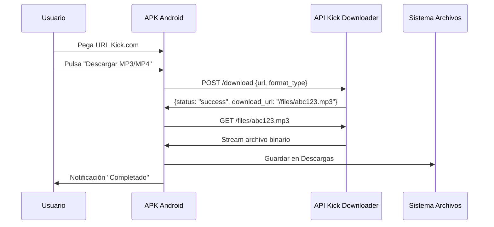

# Guía de Bloques para APK Android (Kodular/Roocode)

> Documentación de la estructura de bloques para conectar la app con la API de Kick Downloader

## Componentes Necesarios

### Interfaz Visual (Diseñador)
| Componente | Tipo | Nombre | Propiedades Importantes |
|------------|------|--------|------------------------|
| TextBox | Entrada | `txtUrlKick` | Hint: "Pega URL de Kick.com aquí" |
| Button | Botón | `btnDescargarMP3` | Text: "Descargar MP3" |
| Button | Botón | `btnDescargarMP4` | Text: "Descargar MP4" |
| Label | Etiqueta | `lblEstado` | Text: "Listo", Visible: true |
| Web | Web | `WebAPI` | Url: (vacío), RequestHeaders: vacío |
| Web | Web | `WebDescarga` | Url: (vacío) |
| Notifier | Notificador | `Notifier1` | - |

### Permisos Requeridos (AndroidManifest)
```xml
<uses-permission android:name="android.permission.INTERNET" />
<uses-permission android:name="android.permission.WRITE_EXTERNAL_STORAGE" />
<uses-permission android:name="android.permission.READ_EXTERNAL_STORAGE" />
<uses-permission android:name="android.permission.ACCESS_NETWORK_STATE" />
```

## Lógica de Bloques (Blocks)

### Variables Globales
```
variable global: SERVER_BASE_URL = "https://TU_DOMINIO.com"  // o http://TU_IP:8000
variable global: DOWNLOAD_ENDPOINT = "/download"
variable global: FILES_ENDPOINT = "/files"
```

### Evento: btnDescargarMP3.Click
```
cuando btnDescargarMP3.Click hacer:
    // 1. Validar entrada
    si txtUrlKick.Text = "" entonces:
        Notifier1.ShowAlert("Por favor pega una URL de Kick.com")
        detener
    
    // 2. Mostrar estado
    lblEstado.Text = "Procesando video..."
    btnDescargarMP3.Enabled = false
    btnDescargarMP4.Enabled = false
    
    // 3. Preparar JSON para la API
    establecer WebAPI.Url a join(SERVER_BASE_URL, DOWNLOAD_ENDPOINT)
    establecer WebAPI.RequestHeaders a {"Content-Type": "application/json"}
    
    // 4. Enviar POST con URL y formato MP3
    establecer WebAPI.JsonText a {
        "url": txtUrlKick.Text,
        "format_type": "mp3"
    }
    llamar WebAPI.PostAsync()
```

### Evento: btnDescargarMP4.Click
```
cuando btnDescargarMP4.Click hacer:
    // Igual que MP3 pero con format_type: "mp4"
    si txtUrlKick.Text = "" entonces:
        Notifier1.ShowAlert("Por favor pega una URL de Kick.com")
        detener
    
    lblEstado.Text = "Procesando video..."
    btnDescargarMP3.Enabled = false
    btnDescargarMP4.Enabled = false
    
    establecer WebAPI.Url a join(SERVER_BASE_URL, DOWNLOAD_ENDPOINT)
    establecer WebAPI.RequestHeaders a {"Content-Type": "application/json"}
    
    establecer WebAPI.JsonText a {
        "url": txtUrlKick.Text,
        "format_type": "mp4"
    }
    llamar WebAPI.PostAsync()
```

### Evento: WebAPI.GotText (Respuesta del servidor)
```
cuando WebAPI.GotText respuesta, responseCode hacer:
    // Rehabilitar botones
    btnDescargarMP3.Enabled = true
    btnDescargarMP4.Enabled = true
    
    si responseCode = 200 entonces:
        // Parsear JSON respuesta
        obtener objeto json de respuesta
        obtener status del json
        
        si status = "success" entonces:
            obtener download_url del json
            // Construir URL completa
            establecer urlCompleta a join(SERVER_BASE_URL, download_url)
            
            lblEstado.Text = "Iniciando descarga..."
            
            // Descargar archivo real
            establecer WebDescarga.Url a urlCompleta
            llamar WebDescarga.DownloadFile()
        sino:
            obtener detail del json
            lblEstado.Text = "Error: " + detail
            Notifier1.ShowAlert("Error del servidor: " + detail)
    sino:
        lblEstado.Text = "Error de conexión: " + responseCode
        Notifier1.ShowAlert("Error de red. Código: " + responseCode)
```

### Evento: WebDescarga.DownloadComplete (Archivo descargado)
```
cuando WebDescarga.DownloadComplete archivo, success hacer:
    si success = true entonces:
        lblEstado.Text = "¡Descarga completada! Archivo guardado en Descargas."
        Notifier1.ShowAlert("Video descargado exitosamente ✓")
    sino:
        lblEstado.Text = "Error en la descarga"
        Notifier1.ShowAlert("La descarga falló. Intenta de nuevo.")
```

### Evento: WebAPI.ErrorOccurred (Error de red)
```
cuando WebAPI.ErrorOccurred errorMessage hacer:
    btnDescargarMP3.Enabled = true
    btnDescargarMP4.Enabled = true
    lblEstado.Text = "Error de conexión"
    Notifier1.ShowAlert("Error de red: " + errorMessage)
```

## Flujo Completo



## Configuración en Kodular/Roocode

### Propiedades del Componente Web (WebAPI)
- **Url**: Se establece dinámicamente en bloques
- **RequestHeaders**: `{"Content-Type": "application/json"}`
- **Timeout**: 300000 (5 minutos para videos largos)

### Propiedades del Componente Web (WebDescarga)
- **Url**: Se establece dinámicamente con la URL de descarga
- **SaveFile**: true (guarda automáticamente en Descargas)
- **FileName**: Se puede extraer de la URL o usar timestamp

## Manejo de Errores Comunes

| Error | Causa | Solución en Bloques |
|-------|-------|---------------------|
| 400 Bad Request | URL no es de Kick.com | Validar antes de enviar |
| 404 Not Found | Archivo ya descargado/borrado | Reintentar descarga |
| 429 Too Many Requests | Rate limit excedido | Esperar y reintentar |
| 500 Server Error | Error en yt-dlp/ffmpeg | Mostrar error, reintentar |
| Timeout | Video muy largo | Aumentar timeout WebAPI |

## Testing Checklist

- [ ] URL válida de Kick.com → Descarga MP3 exitosa
- [ ] URL válida de Kick.com → Descarga MP4 exitosa
- [ ] URL de YouTube → Error 400 "Invalid Kick.com URL"
- [ ] URL vacía → Alerta "Por favor pega una URL"
- [ ] Sin internet → Error de red manejado
- [ ] Video largo (2+ horas) → Timeout configurado correctamente
- [ ] Permisos de almacenamiento → Solicitados al instalar

## Variables de Entorno para la App

En la app, configurar:
```
SERVER_BASE_URL = "https://tu-dominio.com"  // Producción
// o
SERVER_BASE_URL = "http://TU_IP_HETZNER:8000"  // Desarrollo